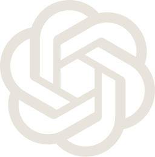

<div align="center">
  
</div>

<br />

<p align="center">
  
  &nbsp;
  
  &nbsp;
  
</p>

---

## Positioning

I build the layers most products never finish: routing, memory, approvals, persistence, and the control surfaces that keep autonomous systems accountable.

The work sits under hard problems. Chambers that need matter memory. Agents that need budgets and kill switches. Models that need governed routing. Devices that should keep private computation local.

The story is not shipping clever demos. It is designing systems that hold when the operational reality gets messy.

---

## Domains

| Domain | Mandate |
| :--- | :--- |
| **Legal infrastructure** | Case operations, cause-list intelligence, drafting systems, and matter memory for Indian practice |
| **AI control planes** | Multi-provider routing, approval loops, agent runtimes, and operator dashboards |
| **Native and local-first** | macOS utilities and on-device interfaces where data and inference stay on the machine |
| **Founder operating systems** | Private OS layers for projects, research, execution state, and agent orchestration |
| **Brand and content systems** | Extraction, tokens, and generation pipelines that keep design output governed |

---

## Stack

Tools are chosen for control, portability, and production discipline. Not fashion.

### Languages and runtimes

<p align="center">
  
  &nbsp;&nbsp;
  
  &nbsp;&nbsp;
  
  &nbsp;&nbsp;
  
  &nbsp;&nbsp;
  
</p>

| Layer | Stack | Why |
| :--- | :--- | :--- |
| Application | TypeScript, React, Next.js, Vite | Typed product surfaces with fast iteration and clean deploy paths |
| Services | Python, FastAPI | Agent tooling, MCP servers, legal pipelines, CLI-heavy systems |
| Native | Swift, Rust, Tauri | macOS-first utilities and lightweight desktop shells without Electron weight |
| Contracts | Zod, SQLAlchemy, Alembic | Schema truth at the boundary: APIs, docs, and migrations stay honest |

### Product and design systems

<p align="center">
  
  &nbsp;&nbsp;
  
  &nbsp;&nbsp;
  
  &nbsp;&nbsp;
  
  &nbsp;&nbsp;
  
  &nbsp;&nbsp;
  
</p>

| Concern | Tools | Role |
| :--- | :--- | :--- |
| Web products | Next.js 15, React 19, Tailwind, shadcn/ui | Operator dashboards and internal systems with sharp density |
| Plugins | Framer Plugin API, Stylekit, BrandFrames | Brand extraction and governed content generation inside design surfaces |
| Monorepos | pnpm, Turborepo | Shared schema/renderer packages without losing package boundaries |
| Validation | Zod | Layout docs, BrandKits, and API payloads as typed contracts |

### Infrastructure and data

<p align="center">
  
  &nbsp;&nbsp;
  
  &nbsp;&nbsp;
  
  &nbsp;&nbsp;
  
  &nbsp;&nbsp;
  
  &nbsp;&nbsp;
  
  &nbsp;&nbsp;
  
</p>

| Concern | Tools | Role |
| :--- | :--- | :--- |
| Data plane | Supabase, PostgreSQL, Google Sheets adapters | Production stores with dual-backend readiness where operators need it |
| Edge and proxy | Cloudflare Workers | Auth, cheapest-route selection, and provider proxying at the edge |
| Deploy | Vercel, Railway, Render, Fly.io | Product surfaces, long-running bots, and volume-backed services |
| Isolation | Docker, git worktrees | Agent validation in clean environments without contaminating the main line |

### AI routing and agent orchestration

<p align="center">
  
  &nbsp;&nbsp;
  
  &nbsp;&nbsp;
  
  &nbsp;&nbsp;
  
  &nbsp;&nbsp;
  
</p>

| Concern | Tools | Role |
| :--- | :--- | :--- |
| Model access | Claude, GPT, OpenRouter-style multi-provider routing | One key, many models, governed spend and partner planes |
| Protocol | MCP servers and skills | Local tools, legal agents, and portable workflows across assistants |
| Orchestration | Loop Engineering, Zeroshot | Report-only loops, blind validation, and crash-safe multi-agent runs |
| Operator channels | Telegram bots, messaging previews | Silent-by-default alerts and approval inboxes where work already lives |
| Councils | Multi-model review patterns | Cross-check drafting and decisions before irreversible actions |

### Native, local-first, and on-device

<p align="center">
  
  &nbsp;&nbsp;
  
  &nbsp;&nbsp;
  
  &nbsp;&nbsp;
  
</p>

| Concern | Tools | Role |
| :--- | :--- | :--- |
| Desktop | Swift (macOS), Tauri + Rust | Offline clipboard systems and lightweight native shells |
| Vision | MediaPipe Tasks Vision | Gesture interfaces that never send the camera off-device |
| Privacy default | Local SQLite, on-disk stores, zero telemetry | Private documents and founder memory stay local unless there is a reason not to |

<details>
<summary><strong>Full capability map</strong></summary>
<br />

```text
Languages     TypeScript · Python · Swift · Rust · JavaScript
Web           Next.js · React · Vite · Tailwind · shadcn/ui
Desktop       Swift · Tauri · Rust · macOS menu-bar apps
Data          Supabase · PostgreSQL · SQLite · Sheets adapters
Edge          Cloudflare Workers · Vercel · Railway · Render · Fly.io
AI            Claude · GPT · OpenRouter · MCP · Loop · Zeroshot
Design        Framer plugins · BrandKit extraction · Zod LayoutDocs
On-device     MediaPipe · local history · offline cleaning
Messaging     Telegram · approval inboxes · silent digests
```

</details>

---

## Selected systems

A strategic map. Not a repository tour.

### Legal operations

| System | Role in the stack |
| :--- | :--- |
| **SHB Case Manager** | Chambers OS for matters, hearings, deadlines, diary reconciliation, and dual Sheets/Supabase backends |
| **Optimist Prime** | Telegram-first legal assistant: cause-list watchers, document memory, drafting, budgeted AI, silent alerts |
| **arya-ai** | Local Indian-law MCP layer: specialist agents, drafting protocols, NCLT/IBC workflows, verification-first routing |
| **Court data rails** | Programmatic access across district courts, high courts, and the Supreme Court for live matter intelligence |

### AI infrastructure

| System | Role in the stack |
| :--- | :--- |
| **Klint** | Unified AI API gateway: one key, multi-provider routing, partner/reseller control plane, usage governance |
| **AgentDock** | Messaging-first agent command center: runtimes, memory profiles, approval inbox, credits, activity ledger |

### Local-first and native

| System | Role in the stack |
| :--- | :--- |
| **klyppr** | Native macOS clipboard system: offline cleaning, local history, zero telemetry |
| **Bloom** | On-device gesture interface: MediaPipe in-browser, camera never leaves the machine |

### Operating layer

| System | Role in the stack |
| :--- | :--- |
| **Eden OS** | Private founder OS: projects, inbox, runs, approvals, audit, backup/restore foundations |
| **Stylekit / BrandFrames** | Brand extraction and governed content generation for design systems inside Framer |

---

## Operating principles

1. **Build the substrate first.** Interfaces without routing, state, and failure modes are decoration.
2. **Keep authority explicit.** Autonomous work needs approvals, budgets, ledgers, and kill switches.
3. **Prefer local when the problem is private.** Clipboard, vision, legal documents, and founder memory should not default to the cloud.
4. **Ship for operators.** Chambers, partners, and agents need control planes, not demos.
5. **Curate ruthlessly.** Few systems, deep ownership, production discipline over catalogue sprawl.

---

## At a glance

```text
┌──────────────────┬────────────────────────────────────────────┐
│ Legal depth      │  32 specialist agents · 235 protocol files │
│ Court coverage   │  700+ district courts · 25 HCs · SC        │
│ AI routing       │  Multi-provider gateway + partner plane    │
│ Native surface   │  Offline macOS utility · on-device vision  │
│ Operating mode   │  Build · operate · refine                  │
└──────────────────┴────────────────────────────────────────────┘
```

---

## Telemetry

<div align="center">


<br /><br />


</div>

<sub>Cards render live from the GitHub API. <code>github-readme-stats</code> is deliberately not used here: its public instance rate limits to 503 for long stretches, and a broken image is worse than one fewer card.</sub>

---

<div align="center">

<br />

**Systems underneath hard problems.**

<br />

<sub>
  EDEN · <code>edenbuilds</code>
  &nbsp;·&nbsp;
  <a href="https://github.com/edenbuilds">github.com/edenbuilds</a>
</sub>

<br /><br />

<sub>For systems work and operating infrastructure, open a conversation through GitHub.</sub>

</div>
