Eden Builds is a one-person studio. I ship production software for clients, send bug fixes to libraries I depend on, and publish tools for working with coding agents.

## Fixes in other people's code

The tables rebuild every day from GitHub. A pull request moves to Merged only after a maintainer merges it.

<!-- oss:start -->
### Merged

| Repository | Pull request |
| :-- | :-- |
| [arktypeio/arktype](https://github.com/arktypeio/arktype) | [Recognize cross-realm arrays with Array.isArray](https://github.com/arktypeio/arktype/pull/1646) |
| [socialincome-san/public](https://github.com/socialincome-san/public) | [Filter Renovate from contributor list](https://github.com/socialincome-san/public/pull/2836) |
| [loop-js/loop.js](https://github.com/loop-js/loop.js) | [Cover guard race table directly](https://github.com/loop-js/loop.js/pull/25) |
| [honojs/middleware](https://github.com/honojs/middleware) | [Notify onclose when standalone SSE stream aborts](https://github.com/honojs/middleware/pull/2075) [Export local z binding so OpenAPI patch is not tree-shaken](https://github.com/honojs/middleware/pull/2069) |
| [alex8088/electron-vite](https://github.com/alex8088/electron-vite) | [Also disable oxc on Vite 8](https://github.com/alex8088/electron-vite/pull/920) |
| [nodejs/undici](https://github.com/nodejs/undici) | [Skip cache-tests when submodule is missing](https://github.com/nodejs/undici/pull/5661) |
| [langchain-ai/langgraphjs](https://github.com/langchain-ai/langgraphjs) | [Always attach Response on HTTPError](https://github.com/langchain-ai/langgraphjs/pull/2668) |
| [mastra-ai/mastra](https://github.com/mastra-ai/mastra) | [Keep generateTitle alive via serverless.waitUntil](https://github.com/mastra-ai/mastra/pull/20996) [Clear workflow.events.v2 topic on durable agent cleanup](https://github.com/mastra-ai/mastra/pull/20961) [Catch rejected workflow /start Run.start()](https://github.com/mastra-ai/mastra/pull/20876) [Serialize TransactionClient queries on one PoolClient](https://github.com/mastra-ai/mastra/pull/20869) |
| [genspark-ai/genoffice](https://github.com/genspark-ai/genoffice) | [Keep multi-turn history valid after empty post-tool turns](https://github.com/genspark-ai/genoffice/pull/27) [Relayout active tab after X11 maximize bounds settle](https://github.com/genspark-ai/genoffice/pull/20) |
| [iamshouvikmitra/bharat-courts](https://github.com/iamshouvikmitra/bharat-courts) | [Cause list PDF links joined against wrong path, always 404](https://github.com/iamshouvikmitra/bharat-courts/pull/7) |

### In review

| Repository | Pull request |
| :-- | :-- |
| [modem-dev/hunk](https://github.com/modem-dev/hunk) | [Reject non-callable VCS operation watch hooks](https://github.com/modem-dev/hunk/pull/1080) |
| [loop-js/loop.js](https://github.com/loop-js/loop.js) | [Expose heartbeat journal progress](https://github.com/loop-js/loop.js/pull/26) |
| [langchain-ai/langchainjs](https://github.com/langchain-ai/langchainjs) | [Skip duplicate tool_call content blocks](https://github.com/langchain-ai/langchainjs/pull/11492) [Handle empty streamed tool arguments](https://github.com/langchain-ai/langchainjs/pull/11379) [Preserve nested anyOf instead of intersecting required](https://github.com/langchain-ai/langchainjs/pull/11315) [Treat empty tool-call args as {} in finalizeContentBlock](https://github.com/langchain-ai/langchainjs/pull/11314) [Script-aware approximate token counting for middleware budgets](https://github.com/langchain-ai/langchainjs/pull/11306) |
| [modelcontextprotocol/typescript-sdk](https://github.com/modelcontextprotocol/typescript-sdk) | [Preserve Streamable HTTP request provenance](https://github.com/modelcontextprotocol/typescript-sdk/pull/2667) |
| [cloudflare/ai](https://github.com/cloudflare/ai) | [Support Moonshot unified catalog slugs](https://github.com/cloudflare/ai/pull/639) [Isolate per-request fetch via Proxy](https://github.com/cloudflare/ai/pull/635) |
| [browserbase/sdk-node](https://github.com/browserbase/sdk-node) | [Let fetch compute content length](https://github.com/browserbase/sdk-node/pull/212) [Omit Content-Type on DELETE requests](https://github.com/browserbase/sdk-node/pull/198) |
| [better-auth/better-auth](https://github.com/better-auth/better-auth) | [Validate password before consuming reset tokens](https://github.com/better-auth/better-auth/pull/10717) |
| [firecrawl/firecrawl](https://github.com/firecrawl/firecrawl) | [Mark sitemap job done even if getCrawl throws](https://github.com/firecrawl/firecrawl/pull/4266), approved [Register NuQ RabbitMQ consumer before setting listener](https://github.com/firecrawl/firecrawl/pull/4263), approved [Stop crawl-status WS polling on client disconnect](https://github.com/firecrawl/firecrawl/pull/4261), approved [Await crawl-status-ws send to avoid unhandledRejection](https://github.com/firecrawl/firecrawl/pull/4253), approved |
| [anthropics/anthropic-sdk-typescript](https://github.com/anthropics/anthropic-sdk-typescript) | [Preserve const/enum in transformJSONSchema](https://github.com/anthropics/anthropic-sdk-typescript/pull/1143) |
| [continuedev/continue](https://github.com/continuedev/continue) | [Suppress org/project headers that break under Turkish locales](https://github.com/continuedev/continue/pull/13097) |
| [inngest/inngest-js](https://github.com/inngest/inngest-js) | [Preserve query string so function-level middleware runs](https://github.com/inngest/inngest-js/pull/1691) |
| [googleapis/js-genai](https://github.com/googleapis/js-genai) | [Bundle p-retry into dist/web browser build](https://github.com/googleapis/js-genai/pull/1835) [Ship CJS .d.cts types for require consumers](https://github.com/googleapis/js-genai/pull/1834) |
| [drizzle-team/drizzle-orm](https://github.com/drizzle-team/drizzle-orm) | [Exclude Neon system roles from provider neon filter](https://github.com/drizzle-team/drizzle-orm/pull/6106) |
| [knex/knex](https://github.com/knex/knex) | [Escape JSON column default values in formatDefault](https://github.com/knex/knex/pull/6511) |
| [vercel/ai](https://github.com/vercel/ai) | [Resume partial tool streams and release errored iterators](https://github.com/vercel/ai/pull/18465) |
<!-- oss:end -->

## What I maintain

| Repository | What it does |
| :-- | :-- |
| [accord](https://github.com/edenbuilds/accord) | MCP gateway and control plane. Policies are explicit, execution is bounded, and every decision leaves a receipt. Developer preview. |
| [agentloop](https://github.com/edenbuilds/agentloop) | Agent harness plugin with councils, capped swarms, plan-execute-verify loops and ship gates. Runs in Cursor, Claude Code, Codex, Copilot and Windsurf. |
| [blackbox](https://github.com/edenbuilds/blackbox) | Reduces Claude Code and Codex transcripts to one append-only event log you can query. No dependencies. |
| [metr](https://github.com/edenbuilds/metr) | macOS menu-bar app that shows how much of your AI usage window is left. Local only, no credentials, no network. |
| [bloom](https://github.com/edenbuilds/bloom) | Raise your hand to open it. The camera stays on the device. |
| [maharashtra-courts-drafting](https://github.com/edenbuilds/maharashtra-courts-drafting) | Local MCP plugin that fills pleadings for the Bombay High Court and Maharashtra tribunals. |

Client work is private. It includes a case manager for a litigation chambers and [Veryfy](https://veryfy.cloud), a diligence platform.

## How I build

Agents that act on their own get approvals, budgets and a kill switch. Private data such as camera frames, clipboard contents and court filings stays on the device by default.

TypeScript, Python, Swift and Rust. Next.js, Supabase, Vercel, Railway and Cloudflare.

## Activity

[edenbuilds.me](https://edenbuilds.me)
