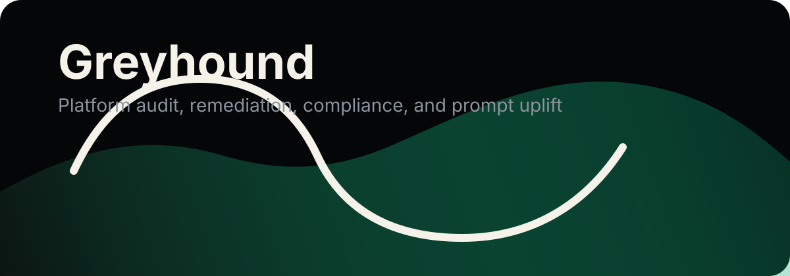

# Greyhound 🐺 Platform Audit

<div align="center">
  
</div>

<br />

<p align="center">
  
  &nbsp;
  
  &nbsp;
  
  &nbsp;
  
</p>

---

## Positioning

Greyhound is the platform mastery pack for serious operators.

It audits and improves any product surface:
- Lovable apps
- Framer sites
- Dashboards and internal tools
- AI and agent systems
- Tauri apps
- Webapps and monorepos

It does not stop at findings. It also upgrades prompts, instructions, workflows, and operator copy so the platform gets sharper, not just cleaner.

Aliases:
- `greyhound`
- `greyhound-audit`
- `greyhound-platform-audit`

## What It Does

| Layer | Focus | Output |
| :--- | :--- | :--- |
| Browser | Authenticated traversal, crawling, screenshots, DOM and network evidence | Real surface coverage |
| UI and UX | Visual hierarchy, accessibility, responsiveness, friction, design system drift | Prioritized interface fixes |
| Performance | Lighthouse, CWV, runtime, bundle, load and stress testing | Measured bottlenecks |
| Security and infra | Secrets, RBAC, auth, logging, dependency and config risk | Risk and remediation plan |
| Compliance | GDPR, DPDP, privacy-by-design, retention, consent, rights handling | Compliance gap review |
| Compliance+ | CCPA/CPRA, UK GDPR, ePrivacy, SOC 2, ISO 27001, PCI DSS, HIPAA, COPPA | Broader control mapping |
| De-slop | Humanize, tighten, and clarify prompts and instructions | Better operator text |
| Policy docs | Privacy policy, T&C, cookie policy, and legal copy from audit context | Drafts with questions if needed |
| Remediation | Diffs, refactors, patch plans, re-audit loop | PR-ready change set |

## Core Modules

| Skill | Role |
| :--- | :--- |
| `greyhound-platform-audit` | Master orchestrator |
| `greyhound-browser-agent` | Browser traversal and structured extraction |
| `greyhound-ui-ux-audit` | UI, UX, accessibility, and visual review |
| `greyhound-perf-stress` | Performance and load testing |
| `greyhound-security-infra` | Security, infra, and observability review |
| `greyhound-framer-specialist` | Framer-specific inspection and fixes |
| `greyhound-gdpr` | GDPR privacy review |
| `greyhound-dpdp` | India DPDP review |
| `greyhound-compliance-suite` | Broader compliance matrix |
| `greyhound-humanize-deslop` | Humanize, de-slop, and sharpen outputs |
| `greyhound-prompt-upgrade` | Improve prompts, commands, and instructions |
| `greyhound-privacy-docs` | Privacy policy and T&C generation |
| `greyhound-remediation-loop` | Fix, verify, and re-audit cycle |

## Icons and Stack

<p align="center">
  
  &nbsp;&nbsp;
  
  &nbsp;&nbsp;
  
  &nbsp;&nbsp;
  
  &nbsp;&nbsp;
  
  &nbsp;&nbsp;
  
  &nbsp;&nbsp;
  
</p>

<p align="center">
  
  &nbsp;&nbsp;
  
  &nbsp;&nbsp;
  
  &nbsp;&nbsp;
  
  &nbsp;&nbsp;
  
  &nbsp;&nbsp;
  
</p>

<p align="center">
  
</p>

## Install

If you want the skill pack foundation:

```bash
npx skills add https://github.com/addyosmani/agent-skills
npx skills add https://github.com/browser-use/browser-use --skill browser-use
```

Then copy or symlink this pack into your skill directory:

```text
~/.codex/skills/greyhound-platform-audit
```

## How To Use

Example prompts:

```text
Use $greyhound-platform-audit to audit this Lovable app end-to-end, then give me fixes and better prompts.
```

```text
Use $greyhound-platform-audit to review this Framer site, check GDPR and DPDP risk, and rewrite the operator instructions so they are cleaner.
```

```text
Use $greyhound-platform-audit to crawl this dashboard, find the highest-risk issues, and generate PR-ready remediation steps.
```

```text
Use $greyhound-privacy-docs with the audit context to draft a privacy policy and terms page. Ask me questions first if accuracy matters.
```

## Operating Model

1. Discover the surface with the browser layer.
2. Audit each layer with evidence.
3. Rank by impact, risk, and effort.
4. Rewrite bad prompts and instructions.
5. Apply fixes when asked.
6. Re-audit to confirm the result.

## Rules

- No hardcoded secrets.
- No fake confidence.
- No generic slop.
- Token use should be efficient, not wasteful.
- Output should be direct, human, and usable.
- Policy docs must match observed behavior and ask questions when enabled or needed for accuracy.

## Extensibility

Add a new skill when the platform needs a dedicated lens.

Examples:
- SEO
- Mobile responsiveness
- Real estate visuals
- Agent governance
- Data residency review
- Legal docs

Keep the master orchestrator small. Put domain detail in the subskill.

## Repo Layout

```text
greyhound-platform-audit/
├── SKILL.md
├── agents/openai.yaml
├── assets/
├── references/
└── greyhound-*.md
```

## Quick Reads

- Architecture: [references/architecture.md](./references/architecture.md)
- Threat model: [references/threat-model.md](./references/threat-model.md)
- Install: [references/install.md](./references/install.md)
- Prompt upgrades: [references/prompt-upgrade.md](./references/prompt-upgrade.md)
- Validation: [references/validation.md](./references/validation.md)
