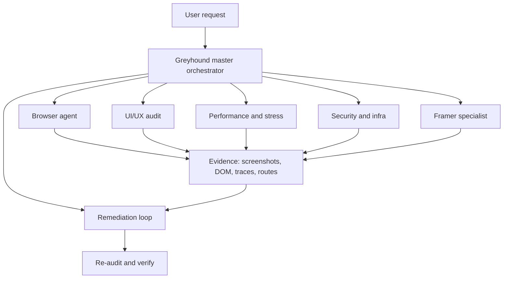

# Greyhound Architecture

Composition model:
- Browser traversal layer from Playwright or browser-use style tooling
- Audit modules for visual, performance, security, and Framer checks
- Remediation loop that emits diffs or patch plans
- Evidence-first reporting for every run

